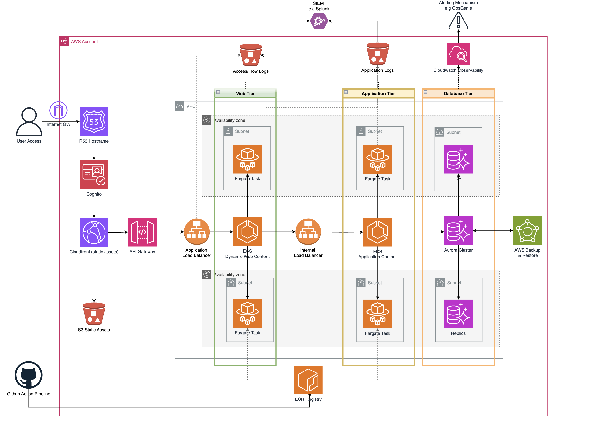

# 3 Tier Web App Solution

## Brief

Your team is tasked with building a new web application for a high-profile product launch. The
application consists of:
1. A public-facing web front end to serve customer traffic.
2. An application layer to handle business logic and API requests.
3. A relational database to store user and transaction data.
The application must handle variable traffic patterns, particularly large spikes during marketing
campaigns. Security and fault tolerance are critical as the application will process sensitive
customer data. The solution must be designed for high availability, scalability, and
cost-effectiveness.
Question:
• Design a three-tier architecture to host this application in AWS, detailing how your
solution addresses scalability, fault tolerance, and security.

• Propose strategies for database management, including ensuring availability and data
recovery.
• Explain how your design would handle unpredictable traffic spikes while keeping costs
manageable.

## Solution Design

## Solution Design Breakdown

### Three-Tier Architecture Overview

- The architecture is divided into Web, Application, and Database tiers
- Each tier is deployed across multiple Availability Zones for high availability.
- The Web Tier handles public-facing traffic, the Application Tier processes business logic and API calls, and the Database Tier stores data.

### Scalability

- ECS with Fargate allows for horizontal scaling of the Web and Application tiers based on demand.
- Application Load Balancer and Internal Load Balancer distribute traffic across multiple Fargate tasks.
- Aurora supports Auto Scaling to automatically adjust the number of read replicas based on read traffic.

### Fault Tolerance:

- Each tier is deployed across multiple Availability Zones to withstand AZ failures.
- Aurora provides built-in replication and failover capabilities.
- Health checks for ECS tasks and load balancers can automatically replace unhealthy instances.
- AWS Backup offers native backup and restore for Aurora DB instances as well as S3 buckets.

### Security:

- Cognito can be used for user authentication and authorization.
- [AWS WAF](https://aws.amazon.com/waf/) (not shown) can also be used if required
- Centralised Logging for trsffic/application logs can be ingested by SIEM services such as Splunk.

In addition to the above, the below is assumed but not shown for readability:

- Least privilege IAM roles and policies to control access to AWS resources.
- Least privilege Security Groups to restrict network traffic between tiers/services.
- Data encrypted at rest (kms) and in transit (ssl).
- Enhanced ECR Scanning enabled with appropraite alerting.
- Vulnerability detection in the CI/CD process to minimise the risk of vulnerable (or misconfigured) images being pushed to the ECR repo.

### Database Management:

- Aurora chosen as it provides multi-az redundancy.
- As mentioned above, AWS Backup has nastive backup support for Aurora.

### Traffic Spikes:

- Fasrgate Auto Scaling used to automatically scale the Web and Application tiers based on demand.
- Cache static content using CloudFront to reduce load on the Web Tier.
- Possible Implement connection pooling to optimize database connections.

### Cost-Effectiveness:

- Fargate should avoid the overheads of both the actual cost of more static ec2 instances as well as the actual operational cost of mantaining the instances.
- Possible to right-size ECS tasks and Aurora instances based on actual resource utilization after a dry-run period before releasing into production.

_Additionally costs can be reduced or maintained with:_
- Saving Plans
- Cost explorer reports
- Cost explorer anomoly detection.

